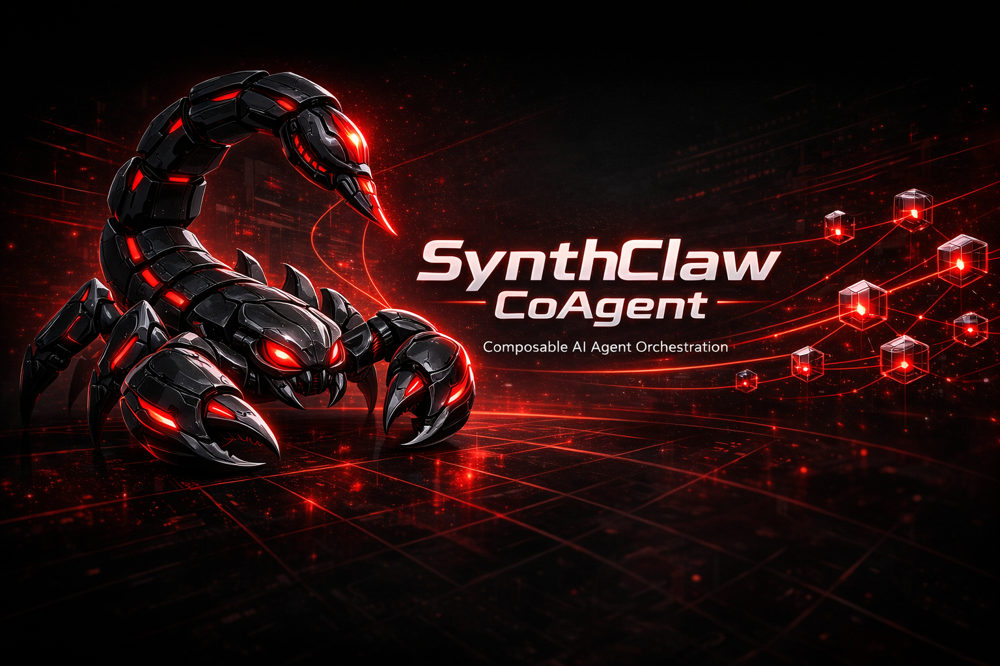

# 🤖 SynthClaw-CoAgent



**Your personal AI agent that lives on a cheap VPS and talks to you through Telegram or WhatsApp.**

SynthClaw-CoAgent is a lightweight, self-hosted AI agent that runs on a single server. It can execute shell commands, manage files, call APIs, run background services, store encrypted credentials, and remember things across conversations — all controlled through natural chat.

---

## 🎯 Why SynthClaw?

There are big agent frameworks out there (see [comparison below](#synthclaw-vs-openclaw)). SynthClaw isn't trying to compete with them. It fills a different gap:

- 👤 **You want a personal AI assistant**, not an enterprise platform
- ⚡ **You want it running in 5 minutes**, not after configuring 47 TOML files
- 💰 **You want it on a $6/month VPS**, not a Kubernetes cluster
- 📱 **You want to chat with it on Telegram/WhatsApp**, not through a CLI or web UI
- 📖 **You want to read and understand the entire codebase** in one sitting (~1300 lines of Python)

---

## ✨ Features

- 💬 **Conversational AI** — Not just a task executor. It chats, explains, has opinions, and knows when to use tools vs just talk.
- 🛠️ **12 Built-in Tools** — Shell commands, file I/O, HTTP requests, systemd services, encrypted credential storage, persistent memory
- 📲 **Telegram + WhatsApp** — Full bot interfaces for both platforms
- 🔌 **Any LLM Backend** — Works with any OpenAI-compatible API (DigitalOcean Gradient AI, OpenAI, Ollama, vLLM, etc.)
- 🔄 **Multi-Model** — Switch between models on the fly with `/model`
- 🔐 **Encrypted Credentials** — Fernet encryption for stored API keys and passwords
- 🧠 **Persistent Memory** — Key-value store that survives across conversations
- 📋 **Planning Mode** — `/plan` breaks tasks into steps without executing
- 🤖 **Agent Mode** — `/agent` executes tasks autonomously, chaining tools without confirmation
- 🔒 **Owner Lock** — First user to `/start` becomes the owner; everyone else is blocked
- ⚙️ **Interactive Setup** — CLI wizard generates your `.env` configuration

---

## 🚀 Quick Start

### 1. Clone

```bash
git clone https://github.com/truehannan/synthclaw-coagent.git
cd synthclaw-coagent
```

### 2. Configure

**Option A — Interactive wizard (recommended):**
```bash
python3 setup_cli.py
```

**Option B — Manual:**
```bash
cp .env.example .env
nano .env  # Fill in your tokens
```

### 3. Deploy to Server

```bash
# Copy files to your VPS
scp -r ./* root@your-server:/opt/agent/

# SSH in and run setup
ssh root@your-server 'bash /opt/agent/setup_server.sh'

# Start the agent
ssh root@your-server 'systemctl start agent'
```

### 4. Chat

Open Telegram, find your bot, send `/start`. That's it.

---

## 📋 Commands

| Command | Description |
|---------|-------------|
| `/start` | Register as owner (first user only) |
| `/help` | Show all commands |
| `/clear` | Wipe conversation history |
| `/model [name]` | Show or switch LLM model |
| `/models` | List available models |
| `/status` | Show running systemd services |
| `/creds` | List stored credentials (values hidden) |
| `/memory` | Show all remembered facts |
| `/run <cmd>` | Execute a shell command directly |
| `/plan <task>` | Break a task into steps (no execution) |
| `/agent <task>` | Autonomous mode — executes without asking |
| `/ping` | Check if the agent is alive |

**Or just chat normally:**
> "What's the best way to set up a cron job?"
>
> "Create a Python script that checks Bitcoin price every hour and logs it"
>
> "Remember my timezone is UTC+5"

---

## 🏗️ Architecture

```
┌──────────────┐     ┌──────────────┐
│   Telegram   │     │   WhatsApp   │
│   (polling)  │     │  (webhooks)  │
└──────┬───────┘     └──────┬───────┘
       │                    │
       └────────┬───────────┘
                │
         ┌──────▼──────┐
         │  Agent Core │  ← LLM + tool-call loop
         │  (agent.py) │
         └──────┬──────┘
                │
    ┌───────────┼───────────┐
    │           │           │
┌───▼───┐ ┌────▼────┐ ┌────▼────┐
│ Tools │ │ Memory  │ │ Config  │
│12 fns │ │ SQLite  │ │  .env   │
│       │ │+Fernet  │ │         │
└───────┘ └─────────┘ └─────────┘
```

**Files:**

| File | Purpose | Lines |
|------|---------|-------|
| `main.py` | Entry point — launches Telegram, WhatsApp, or both | ~40 |
| `agent.py` | Telegram bot + LLM agent loop | ~300 |
| `whatsapp_bot.py` | WhatsApp webhook server (Flask) | ~280 |
| `tools.py` | 12 tool implementations | ~230 |
| `memory.py` | SQLite + Fernet encryption layer | ~170 |
| `config.py` | Environment-based configuration | ~45 |
| `setup_cli.py` | Interactive setup wizard | ~180 |
| `setup_server.sh` | VPS bootstrap script | ~50 |

**Total: ~1300 lines.** You can read and understand the entire thing.

---

## 💬 WhatsApp Setup

WhatsApp uses the [Meta Cloud API](https://developers.facebook.com/docs/whatsapp/cloud-api/get-started) with webhooks (unlike Telegram's polling).

### Steps:

1. Create a [Meta Developer account](https://developers.facebook.com/)
2. Create an app → Add WhatsApp product
3. Get your **Access Token** and **Phone Number ID** from the WhatsApp dashboard
4. Run `python setup_cli.py` and choose "whatsapp" or "both"
5. Deploy to your server
6. Set up your webhook URL in Meta dashboard:
   - URL: `https://your-domain:8443/webhook`
   - Verify token: the one from your `.env`
   - Subscribe to `messages`

> **Note:** You need HTTPS for webhooks. Use nginx + Let's Encrypt or Cloudflare Tunnel.

---

## 🧠 LLM Providers

SynthClaw works with any OpenAI-compatible API. Set `OPENAI_API_BASE` and `OPENAI_API_KEY` in your `.env`.

| Provider | API Base | Notes |
|----------|----------|-------|
| DigitalOcean Gradient AI | `https://inference.do-ai.run/v1` | Default. Llama 3.3, Mistral, DeepSeek |
| OpenAI | `https://api.openai.com/v1` | GPT-4o, GPT-4-mini |
| Ollama (local) | `http://localhost:11434/v1` | Free, runs on your own hardware |
| Together AI | `https://api.together.xyz/v1` | Llama, Mixtral, many open models |
| Groq | `https://api.groq.com/openai/v1` | Fast inference |
| Any vLLM server | `http://your-server:8000/v1` | Self-hosted |

---

## ⚖️ SynthClaw vs OpenClaw

[OpenClaw](https://github.com/openclaw-ai/openclaw) is a massive open-source AI agent infrastructure project — 26K+ stars, 137 contributors, written in Rust. It's impressive engineering. But it solves a different problem.

| | **SynthClaw-CoAgent** | **OpenClaw** |
|---|---|---|
| **Purpose** | Personal assistant for one person | Enterprise agent infrastructure |
| **Language** | Python (~1300 lines) | Node.js (~100K+ lines) |
| **Setup time** | 5 minutes | Complex (Node.js toolchain, TOML configs, binary compilation) |
| **Server requirements** | $6/mo VPS (1 vCPU, 256MB RAM) | Significant resources |
| **Channels** | Telegram + WhatsApp | 17+ (Telegram, Discord, Slack, Matrix, Signal, etc.) |
| **Architecture** | Single process, simple loop | Gateway/daemon, trait-driven, plugin system |
| **LLM integration** | Any OpenAI-compatible API | Custom provider traits, multiple backends |
| **Configuration** | `.env` file + CLI wizard | TOML files, identity system (AIEOS) |
| **Security model** | Owner lock + Fernet encryption | Sandboxing, pairing, allowlists, audit trails |
| **Memory** | SQLite + key-value store | Multiple backends (Redis, Postgres, etc.) |
| **License** | Source Available (non-commercial) | MIT + Apache-2.0 |
| **Who it's for** | Solo developers, personal use | Teams, orgs, production deployments |

**TL;DR:** OpenClaw is a framework for building agent systems. SynthClaw is a ready-to-use personal agent you deploy in 5 minutes and chat with from your phone.

---

## 🔐 Environment Variables

| Variable | Required | Default | Description |
|----------|----------|---------|-------------|
| `INTERFACE_MODE` | No | `telegram` | `telegram`, `whatsapp`, or `both` |
| `TELEGRAM_TOKEN` | If using Telegram | — | Bot token from @BotFather |
| `WHATSAPP_TOKEN` | If using WhatsApp | — | Meta Cloud API access token |
| `WHATSAPP_PHONE_NUMBER_ID` | If using WhatsApp | — | Your WhatsApp phone number ID |
| `WHATSAPP_VERIFY_TOKEN` | If using WhatsApp | `synthclaw-verify` | Webhook verification token |
| `WHATSAPP_PORT` | No | `8443` | Webhook server port |
| `OPENAI_API_KEY` | Yes | — | LLM provider API key |
| `OPENAI_API_BASE` | No | `https://inference.do-ai.run/v1` | LLM API base URL |
| `DEFAULT_MODEL` | No | `llama3.3-70b-instruct` | Default model name |
| `SYNTHCLAW_BASE_DIR` | No | `/opt/agent` | Installation directory |
| `MAX_TOOL_ITERATIONS` | No | `10` | Max tool calls per message |
| `MAX_HISTORY_MESSAGES` | No | `20` | Conversation history length |

---

## 🔧 Built-in Tools

The agent has 12 tools it can use autonomously:

| Tool | What it does |
|------|-------------|
| `run_command` | Execute shell commands |
| `write_file` | Create or overwrite files |
| `read_file` | Read file contents |
| `list_files` | List directory contents |
| `http_request` | Make HTTP requests (GET/POST/PUT/DELETE) |
| `spawn_service` | Create and start a systemd service |
| `stop_service` | Stop a running service |
| `service_status` | Check service status |
| `store_cred` | Store an encrypted credential |
| `get_cred` | Retrieve a stored credential |
| `remember` | Save a persistent fact |
| `recall` | Retrieve saved facts |

---

## 📃 License

This project is released under a **Source Available — Non-Commercial** license.

You are free to use, modify, and share this code for personal and non-commercial purposes. Commercial use requires written permission from the author.

See [LICENSE](LICENSE) for full terms.

---

## 🤝 Contributing

Found a bug? Want to add a feature? PRs are welcome.

Just keep it simple — SynthClaw's entire point is being small and readable.

---

**Made by [@truehannan](https://github.com/truehannan)**
